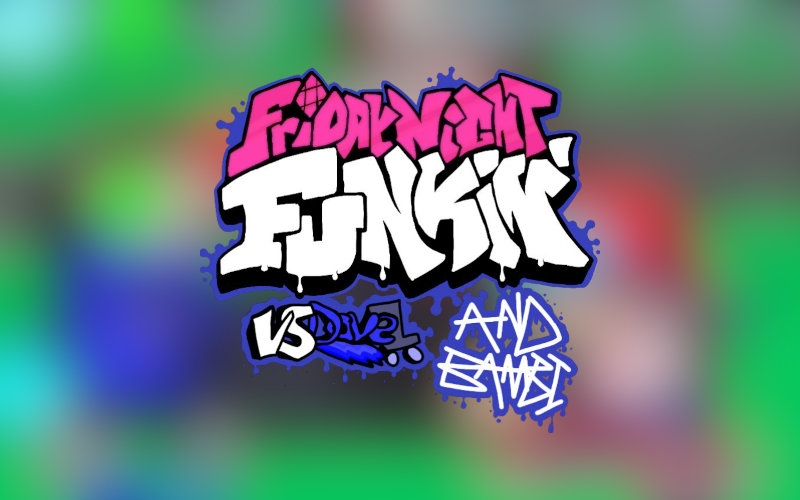

wnewrNING
this mod is rated **D** for ***DEEZ NUTS***

# VS FOXA
this is foxa

say hi to foxa
please say hi to her

## About the engine
Powered by a heavily modified version of Kade Engine, This includes lots of additional improvements such as
- OpenGL Shaders (Leaving it unused for a bit)
- Character Selector (Probably will be remade since I can't seem to DM MissingTextureMan to use it)
- H-Script (WIP)
- Softcoded Characters (WIP, could make a character editor too, if I finish this)
- Languages
- OST Player
- Save Data Menu (Planned)
- Custom States (Planned)
- Custom Substates (WIP, how do I make it accessible)
- [Strawberry Input](https://github.com/benjaminpants/Funkin-Strawberry)

If you're looking to compile the mod/make your own modification, [look here](Modding.md).

Also, install systools, because that's required.

# Credits

* Foxa - Composer, Director
* CharlesCatYT - Main Programmer
* Shadow Mario / mello - Programmer 
~~* TheAnimateMan - Spriter~~
* Monomouse - Jester Programmer
~~* GaragebandCoveryGuy96 - Composer~~
~~* FellowIdiot - Retired Programmer, Charter ~~
~~* LeNinethGames - Icon Artist~~
~~* JoerOnTheBlower (``Amonger#6663``) - NO DONT TRUST THIS GUY (He apologized now but we do not care.)~~
* Erizur and every other Vs. Dave developer (including MissingTextureMan and T5mpler, these were needed to credited.) - made the engine base (i used it as a base btw)
